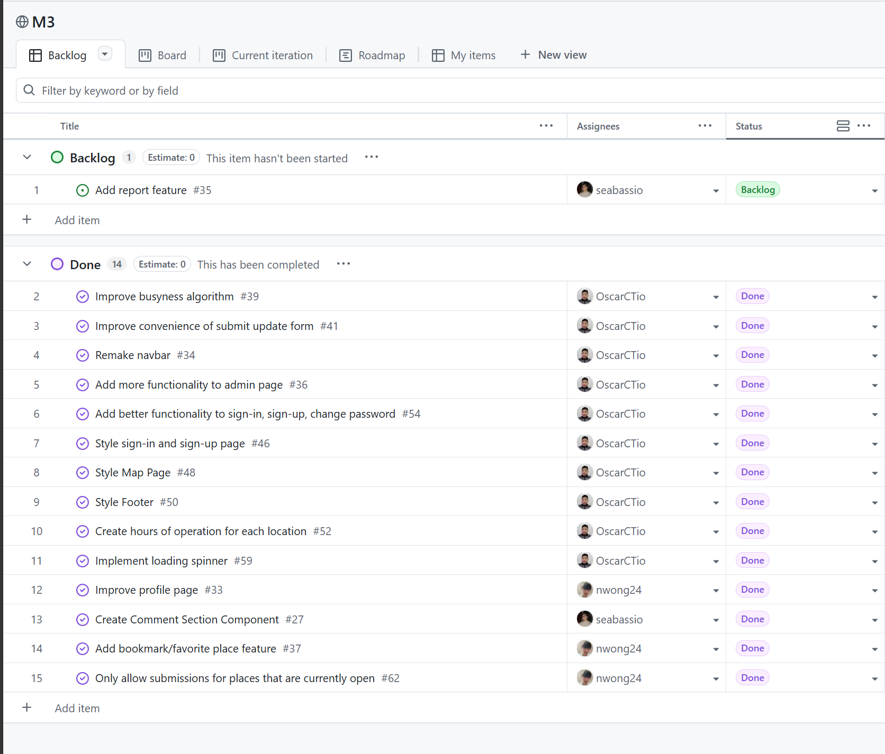
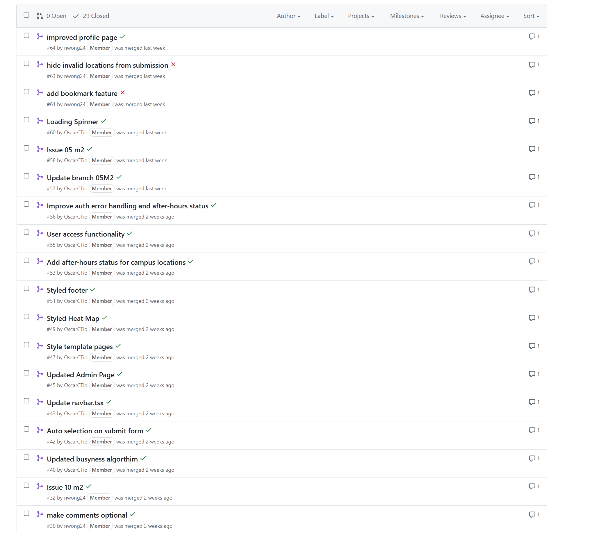

When I first started ICS 314, I thought the class would mainly be about learning how to build web applications. That's pretty much what I heard before taking this class. In one sense, that was true. I learned how to work with Next.js, React, TypeScript, Bootstrap, Prisma, PostgreSQL, GitHub, and Vercel. However, by the end of the semester, I realized that the class was not only about web development. The web application was the environment where we practiced broader software engineering skills. The more important lessons were about how to work on software in a structured, collaborative, and professional way.

The project that helped me understand this the most was Manoa Pulse, a web application my team built to help University of Hawaiʻi at Mānoa students check how busy campus locations are. The app allowed users to view and submit crowd updates for places such as Hamilton Library, Campus Center, Paradise Palms, and the Warrior Recreation Center. While building Manoa Pulse, I learned that writing code is only one part of software engineering. A successful project also requires planning, communication, testing, version control, deployment, and the ability to adapt when things do not work as expected.

<figure class="essay-image-card">
  
  <figcaption>The Manoa Pulse GitHub project board helped our team organize development tasks using issue-driven project management.</figcaption>
</figure>

Three software engineering topics that stood out to me the most were Agile project management, configuration management, and open source software development. These topics are useful far beyond web application development because they apply to almost any technical project that involves building, maintaining, and improving a system over time.

## Agile Project Management

Agile project management is a way of organizing work so that a team can make progress through small, manageable tasks instead of trying to plan and complete everything all at once. In ICS 314, we practiced a style of Agile called Issue Driven Project Management. In this approach, the project is broken into individual issues. Each issue represents a specific task, bug, improvement, or feature. Instead of saying “build the whole application,” the team creates smaller issues such as “create the submit update form,” “add location pages,” “fix the Pulse Feed layout,” or “update the map view.” Each issue can then be assigned, tracked, reviewed, and completed.

This was very useful during the Manoa Pulse project. Since the app had several parts, including authentication, navigation, database models, location pages, a feed, and a map view, it would have been difficult to manage everything without breaking the work into issues. By using issues, our team could see what still needed to be done and who was responsible for each task. It also made the project feel less overwhelming because each issue had a clear goal.

One thing I learned from this process is that Agile project management is not just about moving fast. It is about making progress visible and manageable. When a task was too large or unclear, it became harder to finish. When the task was specific, it was easier to complete and test. For example, “improve Manoa Pulse” is not a very useful task because it is too broad. A better issue would be “redirect the user to the Pulse Feed after submitting an update” because it has a clear expected result.

I can see myself using Issue Driven Project Management outside of web development. For example, in a hardware or microfluidics project, I could create issues for designing a channel, fabricating a mold, testing electrode spacing, collecting impedance data, writing MATLAB analysis scripts, and documenting results. Even though that kind of project is not a web application, it still benefits from breaking the work into smaller tasks. This approach would make it easier to track experiments, assign responsibilities, and understand what still needs to be completed.

## Configuration Management

Configuration management is the process of keeping track of the tools, settings, dependencies, and files needed for a project to run correctly. Before taking this class, I did not think much about configuration. I mostly thought that if the code was correct, the project should work. However, in ICS 314, I learned that a software project can fail even when the code is mostly correct if the configuration is wrong.

This became clear while working on Manoa Pulse. The project depended on many connected parts: Next.js, TypeScript, Prisma, PostgreSQL, NextAuth, environment variables, GitHub Actions, and Vercel deployment settings. If one part was misconfigured, the whole project could break. For example, database models had to match the Prisma schema, environment variables had to be set correctly, and the deployment environment needed the correct database connection. A feature that worked locally could fail on Vercel if the production configuration was different.

I also learned the importance of protecting sensitive configuration files. Files such as `.env` can contain secrets like database URLs or authentication keys. These files should not be committed to GitHub. This showed me that configuration management is not only about making the project work, but also about keeping it secure and maintainable.

Configuration management applies to many fields outside of web development. In an FPGA project, for example, the code is not the only important part. The Vivado project settings, board constraints, pin mappings, and synthesis options all affect whether the design works on real hardware. In a research experiment, configuration could include instrument settings, data collection parameters, file naming conventions, and calibration procedures. If these details are not managed carefully, it becomes difficult to reproduce results or debug problems.

From ICS 314, I learned that software engineering requires discipline around the entire project environment, not just the source code. A working project depends on code, tools, settings, documentation, and deployment all staying consistent with each other.

## Open Source Software Development

Open source software development is the practice of building software in a way that allows others to view, use, modify, or contribute to the code. In ICS 314, GitHub was a major part of how we worked. We used repositories, branches, commits, pull requests, and project boards to manage our code and collaborate with teammates.

Working on Manoa Pulse helped me understand why open source practices are valuable. Since the project was shared through a GitHub organization, the code and project site could be accessed by others. This meant that the project needed to be understandable, not just functional. Good commit messages, readable code, consistent formatting, and project documentation became more important because other people might need to read or continue the work.

<figure class="essay-image-card">
  
  <figcaption>The pull request history shows how GitHub was used to review, merge, and track changes during development.</figcaption>
</figure>

Open source development also taught me the value of collaboration and review. When working on a team, it is easy for one person’s changes to affect another part of the project. Using GitHub made it easier to track changes and review work before merging. It also made mistakes less permanent because the history of the project was saved through commits. If something broke, we could look back and figure out what changed.

This idea applies beyond web applications. Any project involving code or technical design can benefit from open source practices. For example, a MATLAB script for impedance analysis could be stored in a repository with documentation and version history. A SystemVerilog project for an FPGA could use branches for different modules and pull requests for review. Even if the project is not public, using open source-style workflows can make collaboration more organized and reliable.

## What I Learned Overall

The biggest lesson I learned from ICS 314 is that software engineering is about more than writing code that works once. It is about creating systems that other people can understand, maintain, test, and improve. Web development was the main tool we used in the class, but the concepts apply to many other areas.

Through Manoa Pulse, I experienced what it is like to build a project with real users in mind. We had to think about what students needed, how they would interact with the app, and how to make the information useful. At the same time, we had to manage code quality, team communication, project configuration, and deployment. This made the project feel closer to a real software engineering experience than a normal programming assignment.

I also learned that software engineering involves dealing with uncertainty. Sometimes the code did not build. Sometimes the database schema did not match the application. Sometimes a feature worked locally but failed in deployment. These problems were frustrating, but they helped me learn how to debug more carefully and think about the project as a complete system.

In the future, I expect to use these software engineering skills in many different contexts. Whether I am working on a web application, an FPGA design, a research experiment, or a data analysis script, I can apply the same ideas: break work into manageable tasks, manage configuration carefully, use version control, write readable code, and document the project so others can understand it.

ICS 314 taught me that software engineering is not just about the final product. It is about the process used to create that product. A good process makes it easier to collaborate, adapt, debug, and improve. That is the main lesson I will take from this class.
