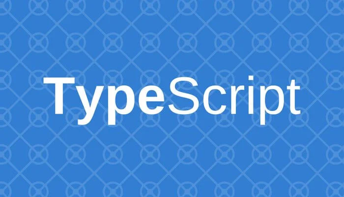

As I continue developing my skills as a software engineer, learning new languages and adapting to different learning styles has become an important part of my academic experience. This course introduced both a new programming language and a demanding learning structure, which challenged me reflect on how I can learn and grow as a programmer.

I entered this course with no prior experience in TypeScript as well as JavaScript. This made my first exposure to the language feel somewhat intimidating but learning new languages is part of being a software engineer. Even though I had no experience with these languages, I'm not completely new to programing as I know how to program in Python, C, and C++. Out of these three languages, Python seems to be the most similar to TypeScript in where both languages are easily readable which made learning TypeScript easier. However, TypeScript has static typing which is similar to C++ which helps with catching errors early. From a software engineering perspective, TypeScript is a great programing language which has features of readability and static typing, which makes code easier to understand while still catching errors at compile time.

Like many things, I believe that the usefulness of this style of learning used in this course will depend on how much time is spent actively engaging with the material and practicing the concepts. Doing the practice WODs are useful when they are worked on as intended. You also get much more satisfaction when you complete a problem using your own skills rather than having tools solve it for you. Even if performance on the WODs wasn't that great, there will always be something you can learn from it to improve next time. The workload from this course is no joke! I'd be lying if I said that this isn't stressful in the slightest. This isn't the only course I'm taking this semester so it is a bit difficult to allocate extra time for practicing and fully engaging with learning new material. If I had more time, I think that using this athletic software engineering technique would increase my programing skills immensely.

Overall, my experience with TypeScript and the learning approach used in this course has helped me better understand what it means to develop software. While the workload and pace can be stressful, the combination of strong language features and hands-on practice encourages long-term growth and self-improvement. With more time and continued effort, I believe both the language and the learning style can significantly contribute to my development as a software engineer.

AI was used while writing this essay.
ChatGPT was asked to rephrase sentences to make them smoother, clearer, or more concise while preserving my original idea or intent.
