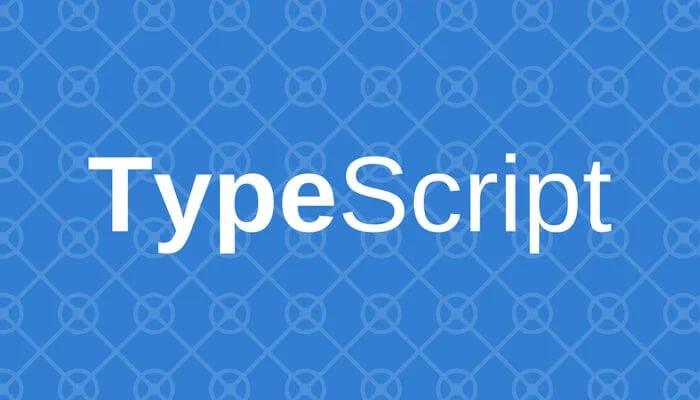

  

  

    As I continue developing my skills as a software engineer, learning new languages and adapting to different learning styles has become an important part of my academic experience. This course introduced me to TypeScript and a faster-paced learning structure, which challenged me to think more carefully about how I learn, practice, and improve as a programmer.
  

  <h2>Starting with TypeScript</h2>

  

    I entered this course with no prior experience in TypeScript or JavaScript, so my first exposure to the language felt intimidating. Even though I was new to these languages, I was not completely new to programming. I had experience with Python, C, and C++, which helped me connect TypeScript to concepts I already knew. Python felt similar in terms of readability, while TypeScript’s static typing reminded me more of C++ because it helps catch certain errors earlier.
  

  <h2>Why TypeScript Is Useful</h2>

  

    From a software engineering perspective, TypeScript is useful because it combines readability with static typing. The code can still be fairly easy to read, but the type system adds another layer of checking before the program runs. This helps catch mistakes that might otherwise be missed until later. As I learned more TypeScript, I started to see how types can make code easier to understand, especially when working with functions, components, and data structures in larger projects.
  

  <h2>Learning Through Practice</h2>

  

    Like many things, I think the usefulness of this course’s learning style depends on how much time is spent actively engaging with the material. The practice WODs are useful when they are worked on as intended because they force you to solve problems under pressure and apply concepts without relying too much on outside help. There is also more satisfaction when I complete a problem using my own skills rather than having a tool solve it for me.
  

  <h2>The Challenge of the Workload</h2>

  

    The workload from this course is no joke. I would be lying if I said it was not stressful at all. Since this is not the only course I am taking this semester, it can be difficult to set aside extra time for practicing and fully engaging with new material. Even when my performance on some WODs is not as strong as I want, there is usually something I can learn from the experience and improve on next time.
  

  <h2>What I Took Away</h2>

  

    Overall, my experience with TypeScript and the learning approach used in this course has helped me better understand what it means to develop software. While the workload and pace can be stressful, the combination of strong language features and hands-on practice encourages long-term growth and self-improvement. With more time and continued effort, I believe both TypeScript and the athletic software engineering approach can significantly contribute to my development as a software engineer.
  

  <strong>AI use note:</strong> AI was used while writing this essay. ChatGPT was asked to rephrase sentences to make them smoother, clearer, or more concise while preserving my original idea or intent.

